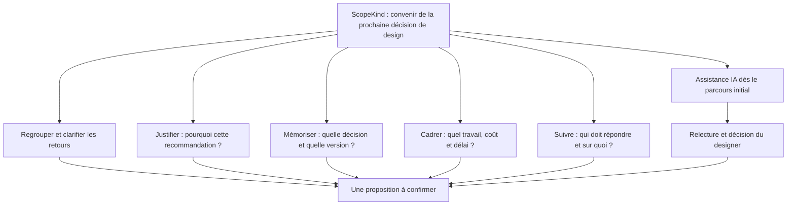

# ScopeKind — Positionnement et périmètre produit

## Décision proposée

ScopeKind aide les freelance brand designers et graphic designers à transformer les retours clients en décisions explicites : ce qui change, pourquoi, sur quelle version et avec quel impact sur le travail.

Promesse : **clarifier les retours, expliquer les choix et convenir de la prochaine révision avant de la réaliser.**

Moment d'usage prioritaire : plusieurs retours arrivent, parfois accompagnés de suggestions IA. Le designer les regroupe, s'appuie sur une synthèse IA reliée aux sources et suit les clarifications et validations nécessaires avant de modifier le livrable.

**Périmètre initial retenu : retours groupés, assistance IA et suivi des demandes en attente sont présents dès la première version produit.** Ce sont des éléments de la même boucle de décision, pas des extensions ultérieures. Ce choix stratégique ne suppose pas qu'une croissance future des retours IA soit déjà quantifiée.

## 1. Ce que les témoignages permettent de dire

| Signal observé                                                                                                                              | Interprétation possible                                                                                               | Limite                                                                                    |
| ------------------------------------------------------------------------------------------------------------------------------------------- | --------------------------------------------------------------------------------------------------------------------- | ----------------------------------------------------------------------------------------- |
| Un designer décrit des clients qui font critiquer leurs épreuves par une IA, produisent des variantes et demandent leur réalisation.        | Le coût de production d'une suggestion baisse ; le travail d'interprétation et de sélection demeure chez le designer. | Le témoignage ne mesure ni la fréquence dans le marché ni une hausse générale.            |
| Un designer estime un manuel à 30 heures et facture environ trois fois ce temps après modifications, avec un minimum facturé de 20 minutes. | Les révisions peuvent être rentables si leur traitement commercial est explicite.                                     | Une règle de facturation peut suffire, sans logiciel supplémentaire.                      |
| « Design as a thinking process has never been more important. »                                                                             | Le raisonnement et la justification du choix pourraient devenir une valeur différenciante.                            | C'est une opinion fournie dans la conversation, pas une preuve de demande pour ScopeKind. |

Sources publiques des deux expériences :

- https://www.reddit.com/r/graphic_design/comments/1uhu7dg/whats_your_process_for_handling_a_client_who/
- https://www.reddit.com/r/graphic_design/comments/1tjf6l4/designers_vs_endless_revisions/

Les liens pointent vers les fils, pas vers des commentaires vérifiés en direct. Les extraits fournis par l'utilisatrice constituent la base de cette analyse. Aucun chiffre de marché, gain de temps ou consentement à payer n'est déduit de ces témoignages.

## 2. Carte des branches de réflexion

### A. Clarification du retour — cœur du produit

- Entrée : message vague, références, capture IA, demandes contradictoires.
- Regrouper plusieurs retours par projet, livrable, version et cycle de révision, tout en conservant auteur, date et provenance de chacun.
- La synthèse ne remplace pas les sources : les demandes similaires peuvent être rapprochées, mais les divergences restent visibles. Le designer peut corriger les regroupements.
- Travail : distinguer l'observation du client, son objectif supposé et la modification proposée.
- Sortie : une interprétation courte que le client confirme ou corrige.
- Point de vigilance : ne pas lui attribuer un objectif qu'il n'a pas exprimé. « Objectif à confirmer » reste distinct de « objectif confirmé ».
- Hypothèse à tester : ce petit accord préalable évite-t-il de partir dans une mauvaise direction ?

### B. Justification créative — différenciation

- Relier la recommandation au brief, à l'audience et aux contraintes d'usage.
- Conserver le pourquoi près du visuel concerné, avec une explication courte.
- Une alternative peut être présentée si elle aide réellement à décider ; aucune génération infinie de variantes n'est requise.
- Point de vigilance : ne pas transformer l'outil en procédure destinée à faire céder le client. Le désaccord peut révéler un objectif qui a changé.
- Hypothèse : le client comprend-il mieux le choix et donne-t-il un accord plus exploitable ?

### C. Mémoire des décisions — continuité

- Enregistrer version ou référence du livrable, changement convenu, raison, validateur et date.
- Réouvrir une décision sans effacer ce qui était convenu précédemment.
- Indiquer si la validation concerne une direction, une révision ou la livraison finale : ces accords ne sont pas interchangeables.
- Prévoir un état « précision nécessaire » et un état « en attente », sans considérer le silence comme un accord.
- Dès la première version, afficher les demandes en attente avec leur responsable, la prochaine action, la date d'envoi, l'échéance convenue si elle existe et le livrable bloqué. Permettre une relance déclenchée par le designer ; ne pas envoyer automatiquement sans paramétrage explicite.
- Inclure les liens entre versions et décisions ainsi qu'un récapitulatif exportable dès le parcours initial.
- Limite : cette trace produit ne constitue pas une garantie juridique ni une signature électronique qualifiée.

### D. Périmètre et rentabilité — valeur économique

- Laisser le designer classer le retour : clarification, révision incluse ou travail supplémentaire.
- Comparer à l'accord effectif du projet, pas à un nombre universel de révisions.
- Décrire le changement, les livrables concernés, le prix ou l'estimation et les conséquences sur le calendrier.
- Obtenir un accord sur ces éléments avant de commencer le travail supplémentaire.
- Accepter les modes forfaitaires et horaires dans la conception ; ne pas imposer les 20 minutes de l'exemple à tous.
- Limite du premier produit : préparer l'accord, sans construire une comptabilité ni un système de paiement.
- Hypothèse : cette étape est-elle utile même quand un contrat et un tarif horaire existent déjà ?

### E. Participation du client — condition d'adoption

- Designer comme organisateur principal ; client comme participant occasionnel.
- Réponse courte, lien simple et contexte lisible, plutôt qu'obligation d'apprendre un outil de conception.
- Possibilité de préparer la fiche à partir de messages reçus dans les canaux habituels.
- Un client peut approuver, demander une précision ou ne pas être d'accord ; aucun choix précoché ne vaut acceptation.
- Identifier la personne habilitée à valider. La gestion de plusieurs niveaux de décideurs peut attendre.
- Hypothèse : le client répond-il effectivement dans ce parcours, ou retourne-t-il à l'email ?

### F. Assistance IA — composante centrale du parcours initial

- Regrouper des retours, proposer une reformulation et signaler une contradiction possible avec une décision précédente.
- Produire une synthèse du lot, les questions de clarification utiles et un brouillon de réponse expliquant le pourquoi à partir du brief et du raisonnement du designer.
- Proposer un classement « clarification / révision incluse / changement potentiel de périmètre » en indiquant le passage du brief ou la décision concernée. Le classement reste à confirmer par le designer.
- Utiliser le contexte autorisé du projet : brief, retours sélectionnés, version et décisions. En cas de contexte insuffisant, demander une précision au lieu de compléter les faits.
- Prévoir dès la V1 les états d'analyse en cours, erreur et résultat partiel, avec possibilité de reprendre manuellement. Aucune analyse simulée ne doit être présentée comme réelle.
- Toujours montrer le retour source et distinguer extraction, suggestion et information confirmée.
- Le designer corrige et valide avant l'envoi ; aucun message, prix ou classement hors périmètre n'est imposé automatiquement.
- Ne pas attribuer une intention au client, noter la qualité esthétique du travail ou promettre une détection certaine du scope creep.
- Avant traitement de documents clients par un fournisseur IA : définir confidentialité, accès, conservation et suppression ; limiter les données partagées.
- Hypothèse : une assistance fait-elle gagner assez de temps par rapport à une fiche manuelle ?

## 3. Périmètre total envisagé, par priorité

| Niveau                          | Inclus                                                                                                                                                                                                                                                                                   | Pourquoi                                                                                             |
| ------------------------------- | ---------------------------------------------------------------------------------------------------------------------------------------------------------------------------------------------------------------------------------------------------------------------------------------- | ---------------------------------------------------------------------------------------------------- |
| P0 — parcours initial à tester  | Brief et versions, retours groupés avec provenance, assistance IA de synthèse/clarification/comparaison, recommandation et pourquoi, impact validé par le designer, réponse client, suivi des demandes en attente et relance manuelle, historique lié aux versions, export récapitulatif | Traiter un cycle de retours complet, de la réception à la décision, avec assistance IA dès le départ |
| P1 — approfondissement          | Modèles personnalisables, intégrations ciblées pour collecter les retours, rappels configurables                                                                                                                                                                                         | Réduire la saisie et adapter le parcours aux usages observés                                         |
| P2 — extensions conditionnelles | Circuits de validation à plusieurs niveaux, suivi agrégé des révisions, gestion d'équipe avancée                                                                                                                                                                                         | Étendre la coordination après validation du parcours initial                                         |
| Hors périmètre                  | Création de logos, génération de variantes, notation automatique du design, éditeur graphique, gestion générale des tâches, CRM, comptabilité, paiement, arbitrage juridique                                                                                                             | Garder un produit centré sur les décisions entre designer et client                                  |

Ce tableau décrit une vision, pas des fonctionnalités déjà disponibles ni un calendrier engagé.

## 4. Modèle minimal d'une décision

Projet et brief → livrable/version → lot de retours et sources → synthèse IA modifiable → objectif à confirmer → recommandation du designer → raison → impact sur le périmètre, le prix et la date → personne qui valide → demande suivie → réponse horodatée.

Chaque lot garde ses retours individuels ; chaque suggestion IA référence ses sources et porte un état « à revoir / corrigée / retenue / écartée ». Chaque demande garde un responsable, la prochaine action, les dates et les décisions auxquelles elle se rapporte. La fermeture d'une demande ne ferme pas automatiquement toutes celles du même lot.

États proposés : brouillon, attente de clarification, prêt pour revue, attente de validation, approuvé, modification demandée, remplacé par une nouvelle décision. Une approbation de direction ne vaut pas automatiquement approbation du prix, ni validation du fichier final.

Le designer doit pouvoir reprendre une réponse reçue ailleurs en indiquant sa provenance. Une transcription par le designer ne doit jamais être présentée comme un clic d'approbation du client.

## 5. Exemple de bout en bout

1. Le designer regroupe trois retours : une demande de rendu « plus premium », une capture IA et un commentaire demandant de garder le caractère convivial.
2. L'IA prépare une synthèse reliée aux trois sources et signale une ambiguïté à clarifier.
3. Le designer relit et propose : « Plus soigné, en restant accessible ? » La demande apparaît en attente de clarification auprès du client.
4. Après confirmation, le designer recommande d'affiner les espacements et la hiérarchie typographique. L'IA peut préparer l'explication à partir de sa recommandation et du brief.
5. Pourquoi : améliorer la clarté tout en gardant la personnalité conviviale approuvée. Impact confirmé par le designer : révision incluse dans le deuxième tour, livraison vendredi.
6. La proposition est suivie comme « en attente d'approbation » avec le client responsable et l'échéance convenue. Le designer peut préparer une relance.
7. Le client approuve l'ensemble ; la décision est liée à la version et le designer commence la révision. Les autres demandes ouvertes restent visibles.
8. Si le client choisit une identité entièrement différente, il confirme d'abord le nouvel objectif, puis examine un devis et une date révisés. Le travail ne démarre qu'après cet accord distinct.

## 6. Validation marché à mener

- Reconstituer des projets récents à partir des messages, versions et accords réels, avec l'autorisation des participants.
- Tester dès le premier pilote le parcours assisté par IA sur des lots de retours réels autorisés, avec suivi des demandes. Garder une fiche manuelle comme comparaison et solution de repli, sans reporter l'IA à une version ultérieure.
- Mesurer la fidélité des synthèses aux sources, les contradictions utiles repérées, les corrections nécessaires et le temps de relecture. Mesurer aussi si le designer identifie rapidement qui doit répondre et ce qui bloque la révision.
- Comparer au fonctionnement habituel de chaque designer : temps de préparation, demandes de clarification, délai de réponse client, changements commencés sans accord et adoption au projet suivant.
- Distinguer gain apparent et transfert de charge : si la fiche prend plus de temps qu'elle n'en économise, simplifier ou revoir l'hypothèse.
- Vérifier le consentement à payer après usage, sans déduire la valeur du seul nombre de révisions.
- Critère de poursuite : le designer et le client utilisent la décision pour avancer, et le designer choisit de réutiliser le parcours.

## 7. Traduction sur le site

- Audience principale : freelance brand et graphic designers, au lieu de tous les métiers freelance.
- Hero : « Turn feedback into clear decisions. »
- Entrée narrative : retour vague, capture IA ou nouvelle direction.
- Présenter dès la première version produit le regroupement des retours, l'assistance IA et le suivi des demandes ouvertes.
- Démonstration : objectif, raison et impact changent avec le choix ; l'état confirme explicitement qu'aucune donnée de projet n'est enregistrée.
- Sections : clarifier, expliquer le pourquoi, convenir du travail ; les révisions supplémentaires peuvent être utiles et rémunératrices.
- Walkthrough : regrouper avec l'IA → clarifier et expliquer → examiner le périmètre → suivre la demande jusqu'à l'accord.
- Bêta : demande d'invitation, exemples illustratifs, pas d'accès produit immédiat promis.
- FAQ : audience, rôle du designer, limites de l'IA, révisions incluses, accès client envisagé.

## 8. État réel du projet après cette modification

La landing page, l'exemple interactif et le walkthrough illustrent ce positionnement. Le formulaire existant collecte les demandes d'invitation. Le site n'implémente pas encore l'espace de projets, la conservation réelle des décisions, les liens de validation clients ou l'analyse IA. Les nouveaux parcours décrits sont des hypothèses produit à tester.
